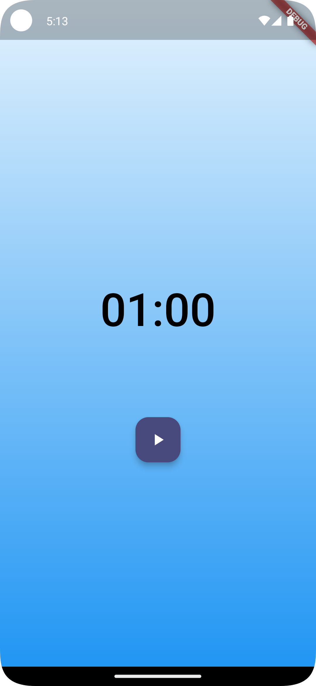
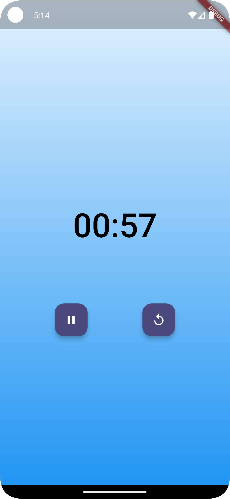
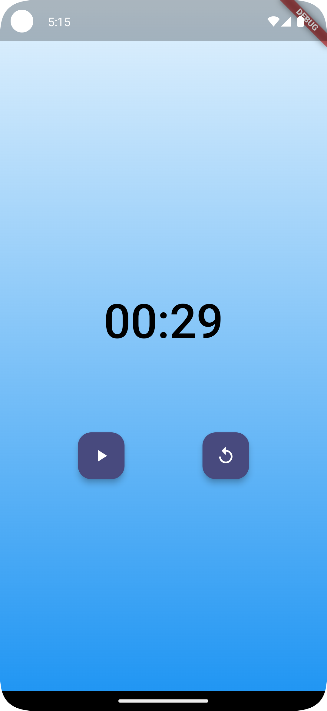

# Flutter Timer App with BLoC

This is a **Flutter Timer Application** that uses the **BLoC (Business Logic Component)** pattern for state management. The app provides a simple and elegant timer interface with functionality to start, pause, resume, and reset the timer. The code is structured for maintainability and follows clean architecture principles.

---

## Features

- **State Management with BLoC**:
  - Timer states include: `TimerInitial`, `TimerRunInProgress`, `TimerRunPause`, and `TimerRunComplete`.
- **Interactive Interface**:
  - Buttons for Play, Pause, Resume, and Reset with intuitive design.
- **Dynamic Background**:
  - Gradient background that enhances the UI experience.
- **Timer Display**:
  - Displays the timer in a `MM:SS` format.

---

## Project Structure

```plaintext
lib/
├── main.dart           # Entry point of the application
├── app.dart            # App initialization and setup
├── ticker.dart         # Ticker utility to handle time progression
├── timer/
│   ├── bloc/           # BLoC files for timer state management
│   │   ├── timer_bloc.dart
│   │   ├── timer_event.dart
│   │   └── timer_state.dart
│   └── view/           # UI-related files
│       ├── timer_page.dart
│       ├── timer_view.dart
│       ├── timer_text.dart
│       ├── actions.dart
│       └── background.dart
```

---

## Installation

1. **Clone the repository**:
   ```bash
   git clone https://github.com/mariocorzo/flutter_timer
   cd flutter_timer
   ```

2. **Install dependencies**:
   Run the following command to fetch the required Flutter packages:
   ```bash
   flutter pub get
   ```

3. **Run the application**:
   Launch the app on a connected device or emulator:
   ```bash
   flutter run
   ```

---

## How It Works

1. **TimerPage**:
    - Provides the `TimerBloc` to the widget tree.
    - Serves as the entry point for the timer feature.

2. **TimerView**:
    - Displays the timer and actions.
    - Handles layout using a combination of widgets like `Column` and `Stack`.

3. **TimerBloc**:
    - Manages the state of the timer using the `Ticker` class for time progression.
    - Reacts to events (`TimerStarted`, `TimerPaused`, `TimerResumed`, `TimerReset`) and updates the state accordingly.

4. **Actions Widget**:
    - Displays buttons based on the current state of the timer.
    - Implements button interactions using `context.read<TimerBloc>().add(Event)`.

5. **Background**:
    - Provides a gradient background for the app.

---

## Example Code

### TimerBloc
```dart
class TimerBloc extends Bloc<TimerEvent, TimerState> {
  final Ticker ticker;
  StreamSubscription<int>? _tickerSubscription;

  TimerBloc({required this.ticker}) : super(TimerInitial(60));
  
  @override
  Stream<TimerState> mapEventToState(TimerEvent event) async* {
    // Handle events like TimerStarted, TimerPaused, etc.
  }
}
```

### TimerText
```dart
class TimerText extends StatelessWidget {
  @override
  Widget build(BuildContext context) {
    final duration = context.select((TimerBloc bloc) => bloc.state.duration);
    final minutes = ((duration / 60) % 60).floor().toString().padLeft(2, '0');
    final seconds = (duration % 60).floor().toString().padLeft(2, '0');
    return Text(
      '$minutes:$seconds',
      style: Theme.of(context).textTheme.displayLarge,
    );
  }
}
```

---

## Dependencies

The project uses the following dependencies:

```yaml
dependencies:
  flutter:
    sdk: flutter
  flutter_bloc: ^8.1.0
```

---

## Screenshots

| Timer Initial State                      | Timer In Progress                                | Timer Paused                           |
|------------------------------------------|--------------------------------------------------|----------------------------------------|
|  |  |  |

---

## License

This project is licensed under the MIT License. See the `LICENSE` file for details.